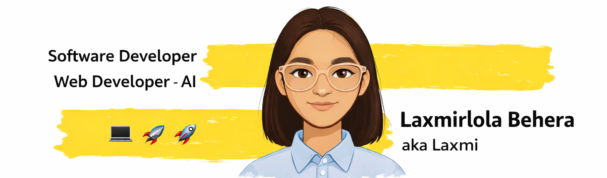

<div align="center">

  

  <p>

</div>

## About Me

I enjoy building products that are both technically strong and genuinely pleasant to use. My work usually sits at the intersection of `frontend`, `backend`, and `applied AI`, with a special interest in projects that solve practical problems.

- Currently building and refining AI-powered apps with end-to-end product thinking
- Interested in machine learning, trustworthy AI, and polished user experiences

## Tech Stack

<p align="center">
  
</p>

## Current Focus

```text
Learning more about:
- Full-stack product engineering
- Retrieval, LLM workflows, and ML-backed apps
- Better UI systems for projects that need clarity and trust
```

## GitHub Snapshot

<div align="center">
  
</div>

<div align="center">
  
  
</div>

## Let's Connect

<p align="center">
  I like collaborating on projects that mix engineering, design, and practical impact.
</p>

<p align="center">
  <a href="mailto:laxmirlolabehera@gmail.com">Email</a> |
  <a href="https://github.com/Laxmirlola">GitHub</a> |
  <a href="https://www.linkedin.com/in/laxmirlola-behera/">LinkedIn</a>
</p>
